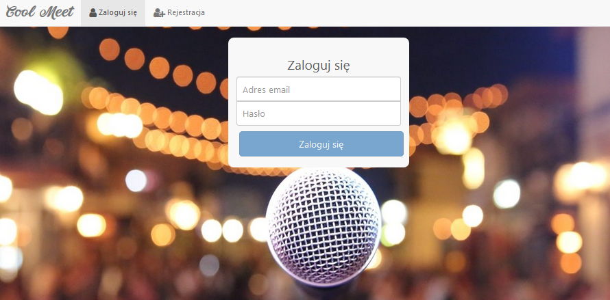
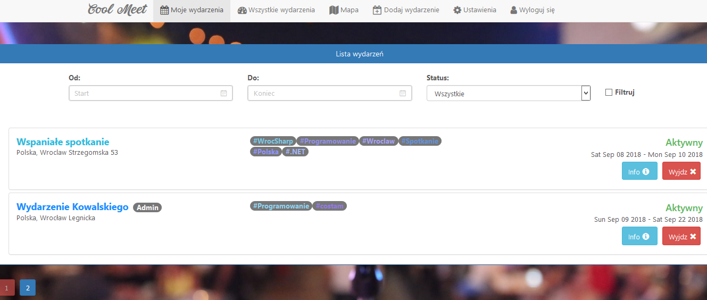
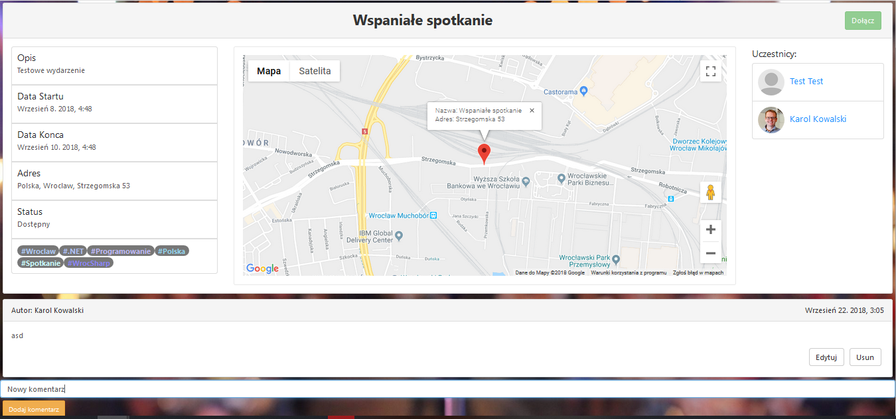
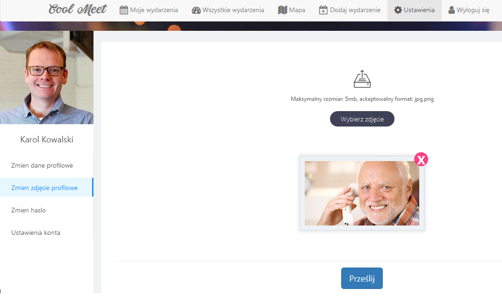
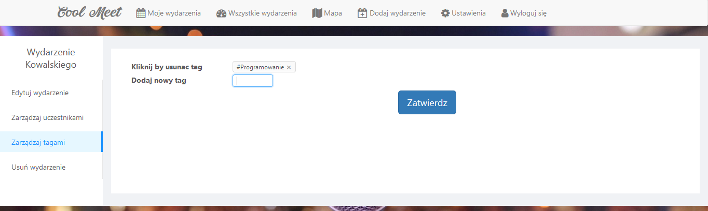
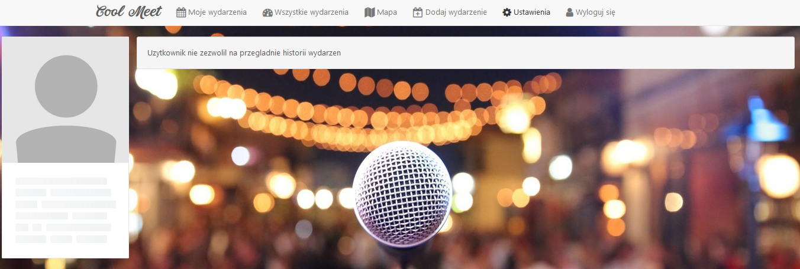

# CoolMeet
# 

## Site
### Events list
### 

### Event view
### 

### Editing profile
### 

### Editing events
### 

### User profile
### 

## Built with 

### Frontend:
- [React](https://reactjs.org/) - A JavaScript library for building user interfaces. Used as frontend.
- [Redux](https://redux.js.org/) - A predictable state container for JavaScript apps.
- [React Bootstrap](https://react-bootstrap.github.io/) - The most popular front-end framework, rebuilt for React.
- [Ant Design](https://ant.design/) - An enterprise-class UI design language and React-based implementation.
- [Google Maps Platform](https://cloud.google.com/maps-platform/)

### Backend:
- [ASP.NET Core 2.0 Web API](https://docs.microsoft.com/en-us/aspnet/core/web-api/?view=aspnetcore-2.0) - a framework that makes it easy to build HTTP services that reach a broad range of clients, including browsers and mobile devices. Used as backend.
- [Entity Framework Core](https://docs.microsoft.com/en-us/ef/core/) - lightweight, extensible, and cross-platform version of the popular Entity Framework data access technology.
- [Automapper](https://automapper.org/) - A convention-based object-object mapper.
- [Swagger](https://swagger.io/) - software framework that helps developers design, build, document, and consume RESTful services
